# Diagrama ER — Central Access Manager (Mermaid)

> Este archivo contiene el diagrama Entidad-Relación completo del modelo de datos de CAM, **incluyendo los atributos de cada tabla**, en formato Mermaid.
>
> Puedes copiar el bloque de código y visualizarlo en:
> - [Mermaid Live Editor](https://mermaid.live)
> - GitHub Markdown (renderiza automáticamente)
> - Visual Studio Code con extensión Mermaid
> - Cualquier herramienta compatible con Mermaid

```mermaid
---
title: Modelo de Base de Datos — Central Access Manager
---
erDiagram
    SYSTEM_APPS {
        VARCHAR_64 id PK
        VARCHAR_32 code UK
        VARCHAR_128 name
        TEXT description
        VARCHAR_8 environment
        VARCHAR_128 owner_name
        VARCHAR_7 color
        TIMESTAMPTZ created_at
    }

    PERMISSIONS {
        VARCHAR_64 id PK
        VARCHAR_64 system_id FK
        VARCHAR_64 code
        VARCHAR_128 name
        TEXT description
        VARCHAR_8 level
        VARCHAR_64 category
    }

    ROLES {
        VARCHAR_64 id PK
        VARCHAR_128 name
        TEXT description
        VARCHAR_64 system_id FK
        BOOLEAN is_admin
        VARCHAR_64 authorizer_user_id FK
        VARCHAR_7 color
        TIMESTAMPTZ created_at
    }

    ROLE_PERMISSIONS {
        VARCHAR_64 role_id PK,FK
        VARCHAR_64 permission_id PK,FK
    }

    USERS {
        VARCHAR_64 id PK
        VARCHAR_64 username UK
        VARCHAR_128 first_name
        VARCHAR_128 last_name
        VARCHAR_128 email
        VARCHAR_128 cargo
        VARCHAR_128 department
        VARCHAR_128 company
        VARCHAR_16 type
        VARCHAR_8 source
        VARCHAR_8 status
        VARCHAR_255 password_hash
        TEXT_ARRAY nodo_ids
        TEXT_ARRAY perfil_codigos
        TEXT_ARRAY role_ids
        TIMESTAMPTZ last_login
        TIMESTAMPTZ created_at
    }

    USER_ROLES {
        VARCHAR_64 user_id PK,FK
        VARCHAR_64 role_id PK,FK
    }

    ACCESS_REQUESTS {
        VARCHAR_64 id PK
        VARCHAR_64 user_id FK
        VARCHAR_64 role_id FK
        VARCHAR_64 system_id FK
        TEXT justification
        VARCHAR_10 status
        VARCHAR_64 requested_by_user_id FK
        TIMESTAMPTZ created_at
        VARCHAR_64 decided_by_user_id FK
        TIMESTAMPTZ decided_at
        TEXT decision_comment
    }

    GRANTS {
        VARCHAR_64 id PK
        VARCHAR_64 user_id FK
        VARCHAR_64 role_id FK
        VARCHAR_64 system_id FK
        TIMESTAMPTZ granted_at
        VARCHAR_64 request_id FK
        VARCHAR_64 authorized_by_user_id FK
    }

    AUDIT_ENTRIES {
        VARCHAR_64 id PK
        TIMESTAMPTZ timestamp
        VARCHAR_128 actor
        VARCHAR_64 action
        VARCHAR_64 entity_type
        VARCHAR_64 entity_id
        TEXT detail
        VARCHAR_45 ip_address
        TEXT user_agent
    }

    APLICACIONES {
        VARCHAR_64 id PK
        VARCHAR_32 codigo UK
        VARCHAR_128 nombre
        TEXT descripcion
        VARCHAR_8 estado
        TIMESTAMPTZ created_at
    }

    APLICACION_NODOS {
        VARCHAR_64 aplicacion_id PK,FK
        VARCHAR_64 nodo_id PK,FK
    }

    MODULOS {
        VARCHAR_64 id PK
        VARCHAR_32 codigo UK
        VARCHAR_128 nombre
        TEXT descripcion
        VARCHAR_32 app_codigo FK
        VARCHAR_8 estado
        INTEGER orden
        TIMESTAMPTZ created_at
    }

    PROGRAMAS {
        VARCHAR_64 id PK
        VARCHAR_32 codigo UK
        VARCHAR_128 nombre
        TEXT descripcion
        VARCHAR_32 mod_codigo FK
        VARCHAR_16 tipo
        VARCHAR_8 estado
        INTEGER orden
        TIMESTAMPTZ created_at
    }

    CONTROLES {
        VARCHAR_64 id PK
        VARCHAR_32 prg_codigo FK
        VARCHAR_32 codigo
        VARCHAR_16 tipo_control
        TEXT descripcion
        VARCHAR_8 estado
        VARCHAR_8 log
        INTEGER orden
        TIMESTAMPTZ created_at
    }

    PERFILES {
        VARCHAR_64 id PK
        VARCHAR_32 codigo UK
        VARCHAR_128 nombre
        TEXT descripcion
        VARCHAR_8 estado
        TIMESTAMPTZ created_at
    }

    PERFIL_PROGRAMAS {
        VARCHAR_64 id PK
        VARCHAR_64 perfil_id FK
        VARCHAR_32 prg_codigo FK
        BOOLEAN nuevo
        BOOLEAN modificar
        BOOLEAN anular
        BOOLEAN procesar
        BOOLEAN imprimir
        BOOLEAN consultar
    }

    PERFIL_PROGRAMA_CONTROLES {
        VARCHAR_64 perfil_programa_id PK,FK
        INTEGER ctrl_index PK
        BOOLEAN visualizar
        BOOLEAN modificar
    }

    NIVELES_SEGREGACION {
        VARCHAR_64 id PK
        VARCHAR_32 codigo UK
        VARCHAR_128 nombre
        INTEGER orden
        VARCHAR_8 estado
        TIMESTAMPTZ created_at
    }

    NODOS_SEGREGACION {
        VARCHAR_64 id PK
        VARCHAR_32 codigo
        VARCHAR_128 nombre
        VARCHAR_64 nivel_id FK
        VARCHAR_64 padre_id FK
        VARCHAR_8 estado
        TIMESTAMPTZ created_at
    }

    NIVELES_ATRIBUTOS {
        VARCHAR_64 id PK
        VARCHAR_64 nivel_id FK
        VARCHAR_32 codigo
        VARCHAR_128 nombre
        VARCHAR_16 tipo
        VARCHAR_32 config_fuente
        BOOLEAN obligatorio
        INTEGER orden
        VARCHAR_8 estado
        TIMESTAMPTZ created_at
    }

    NODOS_ATRIBUTO_VALORES {
        VARCHAR_64 id PK
        VARCHAR_64 nodo_id FK
        VARCHAR_64 atributo_id FK
        TEXT valor
        TIMESTAMPTZ created_at
    }

    USER_NODOS {
        VARCHAR_64 user_id PK,FK
        VARCHAR_64 nodo_id PK,FK
    }

    USER_PERFILES {
        VARCHAR_64 user_id PK,FK
        VARCHAR_32 perfil_codigo PK,FK
    }

    PAISES {
        VARCHAR_64 id PK
        VARCHAR_8 codigo
        VARCHAR_128 descripcion
        VARCHAR_8 estado
        TIMESTAMPTZ created_at
    }

    PROVINCIAS {
        VARCHAR_64 id PK
        VARCHAR_8 codigo
        VARCHAR_128 descripcion
        VARCHAR_64 pais_id FK
        VARCHAR_8 estado
        TIMESTAMPTZ created_at
    }

    CIUDADES {
        VARCHAR_64 id PK
        VARCHAR_16 codigo
        VARCHAR_128 descripcion
        VARCHAR_64 provincia_id FK
        VARCHAR_64 pais_id FK
        VARCHAR_8 estado
        TIMESTAMPTZ created_at
    }

    DISPOSITIVOS_MOVILES {
        VARCHAR_64 id PK
        VARCHAR_32 codigo
        VARCHAR_8 estado
        TIMESTAMPTZ created_at
    }

    GATEWAY_CLIENTS {
        VARCHAR_64 id PK
        VARCHAR_128 name
        VARCHAR_64 client_id UK
        VARCHAR_255 client_secret_hash
        TEXT scopes
        TEXT allowed_ips
        INTEGER rate_limit
        BOOLEAN is_active
        TIMESTAMPTZ created_at
        TIMESTAMPTZ last_used_at
    }

    SYSTEM_APPS ||--o{ PERMISSIONS : "tiene"
    SYSTEM_APPS ||--o{ ROLES : "agrupa"
    ROLES ||--o{ ROLE_PERMISSIONS : ""
    PERMISSIONS ||--o{ ROLE_PERMISSIONS : ""
    ROLES ||--o{ USER_ROLES : ""
    USERS ||--o{ USER_ROLES : "pertenece"
    USERS ||--o{ ACCESS_REQUESTS : "solicita"
    ROLES ||--o{ ACCESS_REQUESTS : ""
    USERS ||--o{ GRANTS : "obtiene"
    ROLES ||--o{ GRANTS : ""
    USERS ||--o{ AUDIT_ENTRIES : "genera"

    %% En la implementación actual los nodos/perfiles se guardan como arrays en USERS.
    %% USER_NODOS y USER_PERFILES son el equivalente normalizado para BD relacional.
    USERS ||--o{ USER_NODOS : "restringido a (alternativa relacional)"
    NODOS_SEGREGACION ||--o{ USER_NODOS : ""
    USERS ||--o{ USER_PERFILES : "usa (alternativa relacional)"
    PERFILES ||--o{ USER_PERFILES : ""

    APLICACIONES ||--o{ APLICACION_NODOS : "visibilidad"
    NODOS_SEGREGACION ||--o{ APLICACION_NODOS : ""
    APLICACIONES ||--o{ MODULOS : "contiene"
    MODULOS ||--o{ PROGRAMAS : "contiene"
    PROGRAMAS ||--o{ CONTROLES : "tiene"
    PROGRAMAS ||--o{ PERFIL_PROGRAMAS : ""
    PERFILES ||--o{ PERFIL_PROGRAMAS : "asigna"
    PERFIL_PROGRAMAS ||--o{ PERFIL_PROGRAMA_CONTROLES : "restringe"

    NIVELES_SEGREGACION ||--o{ NODOS_SEGREGACION : "jerarquía"
    NODOS_SEGREGACION ||--o{ NODOS_SEGREGACION : "padre-hijo"
    NIVELES_SEGREGACION ||--o{ NIVELES_ATRIBUTOS : "define"
    NODOS_SEGREGACION ||--o{ NODOS_ATRIBUTO_VALORES : ""
    NIVELES_ATRIBUTOS ||--o{ NODOS_ATRIBUTO_VALORES : ""

    PAISES ||--o{ PROVINCIAS : "contiene"
    PROVINCIAS ||--o{ CIUDADES : "contiene"
```

## Notas sobre la sintaxis

- `PK` = Primary Key (clave primaria)
- `FK` = Foreign Key (clave foránea)
- `UK` = Unique Key (clave única)
- `TEXT_ARRAY` = Array de texto (`TEXT[]` en PostgreSQL)
- Los tipos se expresan con guiones bajos en lugar de paréntesis para compatibilidad con Mermaid (`VARCHAR_64` en lugar de `VARCHAR(64)`)

## Nota importante sobre accesos de usuario

En la implementación actual del backend (`backend/src/index.ts`), los accesos de un usuario a **nodos de segregación** y **perfiles** no se almacenan en tablas N:M independientes, sino como arrays dentro de la entidad `users`:

- `nodo_ids` → nodos de segregación asignados (pantalla *Nuevo acceso*)
- `perfil_codigos` → perfiles asignados (pantalla *Nuevo acceso*)
- `role_ids` → roles asignados directamente al usuario

Las tablas `USER_NODOS` y `USER_PERFILES` en este diagrama representan el **equivalente normalizado** para una futura migración a base de datos relacional.

## Tablas incluidas

| Dominio | Tablas |
|---------|--------|
| **RBAC clásico** | `system_apps`, `permissions`, `roles`, `role_permissions`, `users`, `user_roles`, `access_requests`, `grants`, `audit_entries` |
| **Seguridades** | `aplicaciones`, `aplicacion_nodos`, `modulos`, `programas`, `controles`, `perfiles`, `perfil_programas`, `perfil_programa_controles` |
| **Segregación dinámica** | `niveles_segregacion`, `nodos_segregacion`, `niveles_atributos`, `nodos_atributo_valores`, `user_nodos`, `user_perfiles` |
| **Parámetros** | `paises`, `provincias`, `ciudades`, `dispositivos_moviles` |
| **API Gateway** | `gateway_clients` |

## Referencias

- Modelo detallado con diccionario de entidades y DDL SQL: [`DATABASE-MODEL.md`](./DATABASE-MODEL.md)
- Inventario de APIs: [`BACKEND-API-ROUTES.md`](./BACKEND-API-ROUTES.md)
