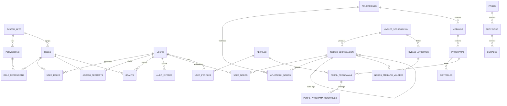

# Modelo de Base de Datos — Central Access Manager

> **Nota:** El backend actual (`backend/src/index.ts`) utiliza almacenamiento en memoria RAM. Este documento describe el **modelo lógico/relacional equivalente** que subyace a las entidades, tipos (`types.ts`) y datos semilla (`seed.ts`) del proyecto.

---

## 1. Visión general

El modelo soporta cuatro dominios principales:

1. **Gobierno de accesos clásico (RBAC):** usuarios, roles, permisos, sistemas, solicitudes y grants.
2. **Seguridades:** jerarquía `Aplicación → Módulo → Programa → Perfil → Control`.
3. **Segregación dinámica:** niveles y nodos de segregación con atributos extensibles.
4. **Parámetros generales:** países, provincias, ciudades y dispositivos móviles.

---

## 2. Diagrama Entidad-Relación (Mermaid)



---

## 3. Diccionario de entidades

### 3.1. Sistemas y permisos

#### `system_apps`
Aplicativos gobernados por la consola.

| Campo | Tipo | Notas |
|-------|------|-------|
| `id` | `VARCHAR(64)` | PK. Ej. `sys_ks8`. |
| `code` | `VARCHAR(32)` | Único. Código corto. |
| `name` | `VARCHAR(128)` | Nombre descriptivo. |
| `description` | `TEXT` | |
| `environment` | `VARCHAR(8)` | `PROD`, `PRE`, `QAS`, `DEV`. |
| `owner_name` | `VARCHAR(128)` | Dueño técnico del sistema. |
| `color` | `VARCHAR(7)` | Color HEX para UI. |
| `created_at` | `TIMESTAMPTZ` | |

#### `permissions`
Permisos/Accesos concretos que otorga un sistema.

| Campo | Tipo | Notas |
|-------|------|-------|
| `id` | `VARCHAR(64)` | PK. |
| `system_id` | `VARCHAR(64)` | FK → `system_apps(id)`. |
| `code` | `VARCHAR(64)` | Código único del permiso. |
| `name` | `VARCHAR(128)` | |
| `description` | `TEXT` | |
| `level` | `VARCHAR(8)` | `VIEW`, `EDIT`, `ADMIN`. |
| `category` | `VARCHAR(64)` | Agrupación funcional. |

#### `roles`
Roles que agrupan permisos de uno o varios sistemas.

| Campo | Tipo | Notas |
|-------|------|-------|
| `id` | `VARCHAR(64)` | PK. |
| `name` | `VARCHAR(128)` | |
| `description` | `TEXT` | |
| `system_id` | `VARCHAR(64)` | FK → `system_apps(id)`. Puede ser `NULL` (rol transversal). |
| `is_admin` | `BOOLEAN` | Acceso completo a la consola. |
| `authorizer_user_id` | `VARCHAR(64)` | FK → `users(id)`. Dueño técnico/autorizador. |
| `color` | `VARCHAR(7)` | |
| `created_at` | `TIMESTAMPTZ` | |

#### `role_permissions`
Relación N:M entre roles y permisos.

| Campo | Tipo | Notas |
|-------|------|-------|
| `role_id` | `VARCHAR(64)` | FK → `roles(id)`. PK compuesta. |
| `permission_id` | `VARCHAR(64)` | FK → `permissions(id)`. PK compuesta. |

---

### 3.2. Usuarios y accesos

#### `users`
Usuarios administradores locales y clientes finales importados de LDAP.

| Campo | Tipo | Notas |
|-------|------|-------|
| `id` | `VARCHAR(64)` | PK. |
| `username` | `VARCHAR(64)` | Único. |
| `first_name` | `VARCHAR(128)` | |
| `last_name` | `VARCHAR(128)` | |
| `email` | `VARCHAR(128)` | |
| `cargo` | `VARCHAR(128)` | |
| `department` | `VARCHAR(128)` | |
| `company` | `VARCHAR(128)` | |
| `type` | `VARCHAR(16)` | `ADMIN` o `CLIENTE_FINAL`. |
| `source` | `VARCHAR(8)` | `LOCAL` o `LDAP`. |
| `status` | `VARCHAR(8)` | `ACTIVE` o `INACTIVE`. |
| `password_hash` | `VARCHAR(255)` | Solo usuarios `LOCAL`; hashing recomendado. |
| `last_login` | `TIMESTAMPTZ` | |
| `created_at` | `TIMESTAMPTZ` | |

#### `user_roles`
Relación N:M entre usuarios y roles.

| Campo | Tipo | Notas |
|-------|------|-------|
| `user_id` | `VARCHAR(64)` | FK → `users(id)`. PK compuesta. |
| `role_id` | `VARCHAR(64)` | FK → `roles(id)`. PK compuesta. |

#### `access_requests`
Solicitudes de acceso a roles pendientes de autorización.

| Campo | Tipo | Notas |
|-------|------|-------|
| `id` | `VARCHAR(64)` | PK. |
| `user_id` | `VARCHAR(64)` | FK → `users(id)`. Solicitante/beneficiario. |
| `role_id` | `VARCHAR(64)` | FK → `roles(id)`. |
| `system_id` | `VARCHAR(64)` | FK → `system_apps(id)`. Redundancia útil para consultas. |
| `justification` | `TEXT` | |
| `status` | `VARCHAR(10)` | `PENDING`, `APPROVED`, `REJECTED`. |
| `requested_by_user_id` | `VARCHAR(64)` | FK → `users(id)`. |
| `created_at` | `TIMESTAMPTZ` | |
| `decided_by_user_id` | `VARCHAR(64)` | FK → `users(id)`. |
| `decided_at` | `TIMESTAMPTZ` | |
| `decision_comment` | `TEXT` | |

#### `grants`
Accesos efectivos vigentes tras aprobación.

| Campo | Tipo | Notas |
|-------|------|-------|
| `id` | `VARCHAR(64)` | PK. |
| `user_id` | `VARCHAR(64)` | FK → `users(id)`. |
| `role_id` | `VARCHAR(64)` | FK → `roles(id)`. |
| `system_id` | `VARCHAR(64)` | FK → `system_apps(id)`. |
| `granted_at` | `TIMESTAMPTZ` | |
| `request_id` | `VARCHAR(64)` | FK → `access_requests(id)`. Puede ser `NULL`. |
| `authorized_by_user_id` | `VARCHAR(64)` | FK → `users(id)`. |

#### `audit_entries`
Registro de auditoría de acciones en la consola.

| Campo | Tipo | Notas |
|-------|------|-------|
| `id` | `VARCHAR(64)` | PK. |
| `timestamp` | `TIMESTAMPTZ` | |
| `actor` | `VARCHAR(128)` | Username o `system`. |
| `action` | `VARCHAR(64)` | Código de acción. |
| `entity_type` | `VARCHAR(64)` | Tipo de entidad afectada. |
| `entity_id` | `VARCHAR(64)` | Id de la entidad. |
| `detail` | `TEXT` | Descripción legible. |
| `ip_address` | `VARCHAR(45)` | *Recomendado agregar.* |
| `user_agent` | `TEXT` | *Recomendado agregar.* |

---

### 3.3. Seguridades

#### `aplicaciones`
Aplicaciones del modelo de seguridades.

| Campo | Tipo | Notas |
|-------|------|-------|
| `id` | `VARCHAR(64)` | PK. |
| `codigo` | `VARCHAR(32)` | Único. |
| `nombre` | `VARCHAR(128)` | |
| `descripcion` | `TEXT` | |
| `estado` | `VARCHAR(8)` | `ACTIVO` / `INACTIVO`. |
| `created_at` | `TIMESTAMPTZ` | |

#### `aplicacion_nodos`
Relación N:M que define a qué nodos de segregación aplica una aplicación.

| Campo | Tipo | Notas |
|-------|------|-------|
| `aplicacion_id` | `VARCHAR(64)` | FK → `aplicaciones(id)`. PK compuesta. |
| `nodo_id` | `VARCHAR(64)` | FK → `nodos_segregacion(id)`. PK compuesta. |

#### `modulos`
Módulos pertenecientes a una aplicación.

| Campo | Tipo | Notas |
|-------|------|-------|
| `id` | `VARCHAR(64)` | PK. |
| `codigo` | `VARCHAR(32)` | Único. |
| `nombre` | `VARCHAR(128)` | |
| `descripcion` | `TEXT` | |
| `app_codigo` | `VARCHAR(32)` | FK → `aplicaciones(codigo)`. |
| `estado` | `VARCHAR(8)` | |
| `orden` | `INTEGER` | |
| `created_at` | `TIMESTAMPTZ` | |

#### `programas`
Programas pertenecientes a un módulo.

| Campo | Tipo | Notas |
|-------|------|-------|
| `id` | `VARCHAR(64)` | PK. |
| `codigo` | `VARCHAR(32)` | Único. |
| `nombre` | `VARCHAR(128)` | |
| `descripcion` | `TEXT` | |
| `mod_codigo` | `VARCHAR(32)` | FK → `modulos(codigo)`. |
| `tipo` | `VARCHAR(16)` | `Menú`, `Submenú`, `Maestro`, `Transacción`, `Proceso`, `Consulta`, `Reporte`, `Objeto`. |
| `estado` | `VARCHAR(8)` | |
| `orden` | `INTEGER` | |
| `created_at` | `TIMESTAMPTZ` | |

#### `controles`
Controles UI asociados a un programa.

| Campo | Tipo | Notas |
|-------|------|-------|
| `id` | `VARCHAR(64)` | PK. |
| `prg_codigo` | `VARCHAR(32)` | FK → `programas(codigo)`. |
| `codigo` | `VARCHAR(32)` | |
| `tipo_control` | `VARCHAR(16)` | `Caja de Texto`, `Botón`, `Check`, `Combo`, `Grid`, `Option`, `Otros`. |
| `descripcion` | `TEXT` | |
| `estado` | `VARCHAR(8)` | |
| `log` | `VARCHAR(8)` | `ACTIVO` / `INACTIVO`. |
| `orden` | `INTEGER` | |
| `created_at` | `TIMESTAMPTZ` | |

#### `perfiles`
Perfiles que agrupan programas con permisos (CRUD) sobre ellos.

| Campo | Tipo | Notas |
|-------|------|-------|
| `id` | `VARCHAR(64)` | PK. |
| `codigo` | `VARCHAR(32)` | Único. |
| `nombre` | `VARCHAR(128)` | |
| `descripcion` | `TEXT` | |
| `estado` | `VARCHAR(8)` | |
| `created_at` | `TIMESTAMPTZ` | |

#### `perfil_programas`
Relación entre perfiles y programas, con flags de permisos.

| Campo | Tipo | Notas |
|-------|------|-------|
| `id` | `VARCHAR(64)` | PK (o compuesta `perfil_id`, `prg_codigo`). |
| `perfil_id` | `VARCHAR(64)` | FK → `perfiles(id)`. |
| `prg_codigo` | `VARCHAR(32)` | FK → `programas(codigo)`. |
| `nuevo` | `BOOLEAN` | |
| `modificar` | `BOOLEAN` | |
| `anular` | `BOOLEAN` | |
| `procesar` | `BOOLEAN` | |
| `imprimir` | `BOOLEAN` | |
| `consultar` | `BOOLEAN` | |

#### `perfil_programa_controles`
Permisos a nivel de controles dentro de un programa de un perfil.

| Campo | Tipo | Notas |
|-------|------|-------|
| `perfil_programa_id` | `VARCHAR(64)` | FK → `perfil_programas(id)`. PK compuesta. |
| `ctrl_index` | `INTEGER` | Índice del control dentro del programa. |
| `visualizar` | `BOOLEAN` | |
| `modificar` | `BOOLEAN` | |

---

### 3.4. Segregación dinámica

#### `niveles_segregacion`
Niveles configurables de la jerarquía de segregación.

| Campo | Tipo | Notas |
|-------|------|-------|
| `id` | `VARCHAR(64)` | PK. |
| `codigo` | `VARCHAR(32)` | Único. |
| `nombre` | `VARCHAR(128)` | Ej. `Empresa`, `Sucursal`. |
| `orden` | `INTEGER` | Posición en la jerarquía. |
| `estado` | `VARCHAR(8)` | |
| `created_at` | `TIMESTAMPTZ` | |

#### `nodos_segregacion`
Nodos concretos de cada nivel, con estructura jerárquica padre-hijo.

| Campo | Tipo | Notas |
|-------|------|-------|
| `id` | `VARCHAR(64)` | PK. |
| `codigo` | `VARCHAR(32)` | |
| `nombre` | `VARCHAR(128)` | |
| `nivel_id` | `VARCHAR(64)` | FK → `niveles_segregacion(id)`. |
| `padre_id` | `VARCHAR(64)` | FK → `nodos_segregacion(id)`. `NULL` para raíces. |
| `estado` | `VARCHAR(8)` | |
| `created_at` | `TIMESTAMPTZ` | |

#### `niveles_atributos`
Atributos extensibles definidos para cada nivel.

| Campo | Tipo | Notas |
|-------|------|-------|
| `id` | `VARCHAR(64)` | PK. |
| `nivel_id` | `VARCHAR(64)` | FK → `niveles_segregacion(id)`. |
| `codigo` | `VARCHAR(32)` | |
| `nombre` | `VARCHAR(128)` | |
| `tipo` | `VARCHAR(16)` | `texto`, `numero`, `telefono`, `email`, `select`. |
| `config_fuente` | `VARCHAR(32)` | Para selects: `paises`, `provincias`, `ciudades`. |
| `obligatorio` | `BOOLEAN` | |
| `orden` | `INTEGER` | |
| `estado` | `VARCHAR(8)` | |
| `created_at` | `TIMESTAMPTZ` | |

#### `nodos_atributo_valores`
Valores de atributos para cada nodo.

| Campo | Tipo | Notas |
|-------|------|-------|
| `id` | `VARCHAR(64)` | PK. |
| `nodo_id` | `VARCHAR(64)` | FK → `nodos_segregacion(id)`. |
| `atributo_id` | `VARCHAR(64)` | FK → `niveles_atributos(id)`. |
| `valor` | `TEXT` | |
| `created_at` | `TIMESTAMPTZ` | |

#### `user_nodos`
Relación N:M entre usuarios y nodos de segregación (ámbito de acceso).

| Campo | Tipo | Notas |
|-------|------|-------|
| `user_id` | `VARCHAR(64)` | FK → `users(id)`. PK compuesta. |
| `nodo_id` | `VARCHAR(64)` | FK → `nodos_segregacion(id)`. PK compuesta. |

#### `user_perfiles`
Relación N:M entre usuarios y perfiles.

| Campo | Tipo | Notas |
|-------|------|-------|
| `user_id` | `VARCHAR(64)` | FK → `users(id)`. PK compuesta. |
| `perfil_codigo` | `VARCHAR(32)` | FK → `perfiles(codigo)`. PK compuesta. |

---

### 3.5. Parámetros

#### `paises`

| Campo | Tipo | Notas |
|-------|------|-------|
| `id` | `VARCHAR(64)` | PK. |
| `codigo` | `VARCHAR(8)` | |
| `descripcion` | `VARCHAR(128)` | |
| `estado` | `VARCHAR(8)` | |
| `created_at` | `TIMESTAMPTZ` | |

#### `provincias`

| Campo | Tipo | Notas |
|-------|------|-------|
| `id` | `VARCHAR(64)` | PK. |
| `codigo` | `VARCHAR(8)` | |
| `descripcion` | `VARCHAR(128)` | |
| `pais_id` | `VARCHAR(64)` | FK → `paises(id)`. |
| `estado` | `VARCHAR(8)` | |
| `created_at` | `TIMESTAMPTZ` | |

#### `ciudades`

| Campo | Tipo | Notas |
|-------|------|-------|
| `id` | `VARCHAR(64)` | PK. |
| `codigo` | `VARCHAR(16)` | |
| `descripcion` | `VARCHAR(128)` | |
| `provincia_id` | `VARCHAR(64)` | FK → `provincias(id)`. |
| `pais_id` | `VARCHAR(64)` | FK → `paises(id)`. |
| `estado` | `VARCHAR(8)` | |
| `created_at` | `TIMESTAMPTZ` | |

#### `dispositivos_moviles`

| Campo | Tipo | Notas |
|-------|------|-------|
| `id` | `VARCHAR(64)` | PK. |
| `codigo` | `VARCHAR(32)` | |
| `estado` | `VARCHAR(8)` | |
| `created_at` | `TIMESTAMPTZ` | |

---

## 4. DDL SQL (PostgreSQL)

```sql
-- =====================================================
-- 1. Sistemas y permisos
-- =====================================================
CREATE TABLE system_apps (
    id VARCHAR(64) PRIMARY KEY,
    code VARCHAR(32) UNIQUE NOT NULL,
    name VARCHAR(128) NOT NULL,
    description TEXT,
    environment VARCHAR(8) NOT NULL DEFAULT 'DEV',
    owner_name VARCHAR(128),
    color VARCHAR(7) DEFAULT '#2563eb',
    created_at TIMESTAMPTZ NOT NULL DEFAULT NOW()
);

CREATE TABLE permissions (
    id VARCHAR(64) PRIMARY KEY,
    system_id VARCHAR(64) NOT NULL REFERENCES system_apps(id) ON DELETE CASCADE,
    code VARCHAR(64) NOT NULL,
    name VARCHAR(128) NOT NULL,
    description TEXT,
    level VARCHAR(8) NOT NULL,
    category VARCHAR(64),
    UNIQUE (system_id, code)
);

CREATE TABLE roles (
    id VARCHAR(64) PRIMARY KEY,
    name VARCHAR(128) NOT NULL,
    description TEXT,
    system_id VARCHAR(64) REFERENCES system_apps(id) ON DELETE SET NULL,
    is_admin BOOLEAN NOT NULL DEFAULT FALSE,
    authorizer_user_id VARCHAR(64),
    color VARCHAR(7) DEFAULT '#2563eb',
    created_at TIMESTAMPTZ NOT NULL DEFAULT NOW()
);

CREATE TABLE role_permissions (
    role_id VARCHAR(64) NOT NULL REFERENCES roles(id) ON DELETE CASCADE,
    permission_id VARCHAR(64) NOT NULL REFERENCES permissions(id) ON DELETE CASCADE,
    PRIMARY KEY (role_id, permission_id)
);

-- =====================================================
-- 2. Usuarios y accesos
-- =====================================================
CREATE TABLE users (
    id VARCHAR(64) PRIMARY KEY,
    username VARCHAR(64) UNIQUE NOT NULL,
    first_name VARCHAR(128) NOT NULL,
    last_name VARCHAR(128) NOT NULL,
    email VARCHAR(128) NOT NULL,
    cargo VARCHAR(128),
    department VARCHAR(128),
    company VARCHAR(128) DEFAULT 'Reybanpac',
    type VARCHAR(16) NOT NULL,
    source VARCHAR(8) NOT NULL,
    status VARCHAR(8) NOT NULL DEFAULT 'ACTIVE',
    password_hash VARCHAR(255),
    last_login TIMESTAMPTZ,
    created_at TIMESTAMPTZ NOT NULL DEFAULT NOW()
);

ALTER TABLE roles ADD CONSTRAINT fk_roles_authorizer
    FOREIGN KEY (authorizer_user_id) REFERENCES users(id) ON DELETE SET NULL;

CREATE TABLE user_roles (
    user_id VARCHAR(64) NOT NULL REFERENCES users(id) ON DELETE CASCADE,
    role_id VARCHAR(64) NOT NULL REFERENCES roles(id) ON DELETE CASCADE,
    PRIMARY KEY (user_id, role_id)
);

CREATE TABLE access_requests (
    id VARCHAR(64) PRIMARY KEY,
    user_id VARCHAR(64) NOT NULL REFERENCES users(id) ON DELETE CASCADE,
    role_id VARCHAR(64) NOT NULL REFERENCES roles(id) ON DELETE CASCADE,
    system_id VARCHAR(64) REFERENCES system_apps(id) ON DELETE SET NULL,
    justification TEXT,
    status VARCHAR(10) NOT NULL DEFAULT 'PENDING',
    requested_by_user_id VARCHAR(64) NOT NULL REFERENCES users(id),
    created_at TIMESTAMPTZ NOT NULL DEFAULT NOW(),
    decided_by_user_id VARCHAR(64) REFERENCES users(id),
    decided_at TIMESTAMPTZ,
    decision_comment TEXT
);

CREATE TABLE grants (
    id VARCHAR(64) PRIMARY KEY,
    user_id VARCHAR(64) NOT NULL REFERENCES users(id) ON DELETE CASCADE,
    role_id VARCHAR(64) NOT NULL REFERENCES roles(id) ON DELETE CASCADE,
    system_id VARCHAR(64) REFERENCES system_apps(id) ON DELETE SET NULL,
    granted_at TIMESTAMPTZ NOT NULL DEFAULT NOW(),
    request_id VARCHAR(64) REFERENCES access_requests(id) ON DELETE SET NULL,
    authorized_by_user_id VARCHAR(64) REFERENCES users(id)
);

CREATE TABLE audit_entries (
    id VARCHAR(64) PRIMARY KEY,
    timestamp TIMESTAMPTZ NOT NULL DEFAULT NOW(),
    actor VARCHAR(128) NOT NULL,
    action VARCHAR(64) NOT NULL,
    entity_type VARCHAR(64) NOT NULL,
    entity_id VARCHAR(64),
    detail TEXT,
    ip_address VARCHAR(45),
    user_agent TEXT
);

-- =====================================================
-- 3. Seguridades
-- =====================================================
CREATE TABLE aplicaciones (
    id VARCHAR(64) PRIMARY KEY,
    codigo VARCHAR(32) UNIQUE NOT NULL,
    nombre VARCHAR(128) NOT NULL,
    descripcion TEXT,
    estado VARCHAR(8) NOT NULL DEFAULT 'ACTIVO',
    created_at TIMESTAMPTZ NOT NULL DEFAULT NOW()
);

CREATE TABLE aplicacion_nodos (
    aplicacion_id VARCHAR(64) NOT NULL REFERENCES aplicaciones(id) ON DELETE CASCADE,
    nodo_id VARCHAR(64) NOT NULL REFERENCES nodos_segregacion(id) ON DELETE CASCADE,
    PRIMARY KEY (aplicacion_id, nodo_id)
);

CREATE TABLE modulos (
    id VARCHAR(64) PRIMARY KEY,
    codigo VARCHAR(32) UNIQUE NOT NULL,
    nombre VARCHAR(128) NOT NULL,
    descripcion TEXT,
    app_codigo VARCHAR(32) NOT NULL REFERENCES aplicaciones(codigo) ON DELETE CASCADE,
    estado VARCHAR(8) NOT NULL DEFAULT 'ACTIVO',
    orden INTEGER,
    created_at TIMESTAMPTZ NOT NULL DEFAULT NOW()
);

CREATE TABLE programas (
    id VARCHAR(64) PRIMARY KEY,
    codigo VARCHAR(32) UNIQUE NOT NULL,
    nombre VARCHAR(128) NOT NULL,
    descripcion TEXT,
    mod_codigo VARCHAR(32) NOT NULL REFERENCES modulos(codigo) ON DELETE CASCADE,
    tipo VARCHAR(16) NOT NULL,
    estado VARCHAR(8) NOT NULL DEFAULT 'ACTIVO',
    orden INTEGER,
    created_at TIMESTAMPTZ NOT NULL DEFAULT NOW()
);

CREATE TABLE controles (
    id VARCHAR(64) PRIMARY KEY,
    prg_codigo VARCHAR(32) NOT NULL REFERENCES programas(codigo) ON DELETE CASCADE,
    codigo VARCHAR(32) NOT NULL,
    tipo_control VARCHAR(16) NOT NULL,
    descripcion TEXT,
    estado VARCHAR(8) NOT NULL DEFAULT 'ACTIVO',
    log VARCHAR(8) NOT NULL DEFAULT 'ACTIVO',
    orden INTEGER,
    created_at TIMESTAMPTZ NOT NULL DEFAULT NOW(),
    UNIQUE (prg_codigo, codigo)
);

CREATE TABLE perfiles (
    id VARCHAR(64) PRIMARY KEY,
    codigo VARCHAR(32) UNIQUE NOT NULL,
    nombre VARCHAR(128) NOT NULL,
    descripcion TEXT,
    estado VARCHAR(8) NOT NULL DEFAULT 'ACTIVO',
    created_at TIMESTAMPTZ NOT NULL DEFAULT NOW()
);

CREATE TABLE perfil_programas (
    id VARCHAR(64) PRIMARY KEY,
    perfil_id VARCHAR(64) NOT NULL REFERENCES perfiles(id) ON DELETE CASCADE,
    prg_codigo VARCHAR(32) NOT NULL REFERENCES programas(codigo) ON DELETE CASCADE,
    nuevo BOOLEAN NOT NULL DEFAULT FALSE,
    modificar BOOLEAN NOT NULL DEFAULT FALSE,
    anular BOOLEAN NOT NULL DEFAULT FALSE,
    procesar BOOLEAN NOT NULL DEFAULT FALSE,
    imprimir BOOLEAN NOT NULL DEFAULT FALSE,
    consultar BOOLEAN NOT NULL DEFAULT FALSE,
    UNIQUE (perfil_id, prg_codigo)
);

CREATE TABLE perfil_programa_controles (
    perfil_programa_id VARCHAR(64) NOT NULL REFERENCES perfil_programas(id) ON DELETE CASCADE,
    ctrl_index INTEGER NOT NULL,
    visualizar BOOLEAN NOT NULL DEFAULT FALSE,
    modificar BOOLEAN NOT NULL DEFAULT FALSE,
    PRIMARY KEY (perfil_programa_id, ctrl_index)
);

-- =====================================================
-- 4. Segregación dinámica
-- =====================================================
CREATE TABLE niveles_segregacion (
    id VARCHAR(64) PRIMARY KEY,
    codigo VARCHAR(32) UNIQUE NOT NULL,
    nombre VARCHAR(128) NOT NULL,
    orden INTEGER NOT NULL,
    estado VARCHAR(8) NOT NULL DEFAULT 'ACTIVO',
    created_at TIMESTAMPTZ NOT NULL DEFAULT NOW()
);

CREATE TABLE nodos_segregacion (
    id VARCHAR(64) PRIMARY KEY,
    codigo VARCHAR(32) NOT NULL,
    nombre VARCHAR(128) NOT NULL,
    nivel_id VARCHAR(64) NOT NULL REFERENCES niveles_segregacion(id) ON DELETE CASCADE,
    padre_id VARCHAR(64) REFERENCES nodos_segregacion(id) ON DELETE CASCADE,
    estado VARCHAR(8) NOT NULL DEFAULT 'ACTIVO',
    created_at TIMESTAMPTZ NOT NULL DEFAULT NOW()
);

CREATE TABLE niveles_atributos (
    id VARCHAR(64) PRIMARY KEY,
    nivel_id VARCHAR(64) NOT NULL REFERENCES niveles_segregacion(id) ON DELETE CASCADE,
    codigo VARCHAR(32) NOT NULL,
    nombre VARCHAR(128) NOT NULL,
    tipo VARCHAR(16) NOT NULL,
    config_fuente VARCHAR(32),
    obligatorio BOOLEAN NOT NULL DEFAULT FALSE,
    orden INTEGER,
    estado VARCHAR(8) NOT NULL DEFAULT 'ACTIVO',
    created_at TIMESTAMPTZ NOT NULL DEFAULT NOW(),
    UNIQUE (nivel_id, codigo)
);

CREATE TABLE nodos_atributo_valores (
    id VARCHAR(64) PRIMARY KEY,
    nodo_id VARCHAR(64) NOT NULL REFERENCES nodos_segregacion(id) ON DELETE CASCADE,
    atributo_id VARCHAR(64) NOT NULL REFERENCES niveles_atributos(id) ON DELETE CASCADE,
    valor TEXT NOT NULL,
    created_at TIMESTAMPTZ NOT NULL DEFAULT NOW()
);

CREATE TABLE user_nodos (
    user_id VARCHAR(64) NOT NULL REFERENCES users(id) ON DELETE CASCADE,
    nodo_id VARCHAR(64) NOT NULL REFERENCES nodos_segregacion(id) ON DELETE CASCADE,
    PRIMARY KEY (user_id, nodo_id)
);

CREATE TABLE user_perfiles (
    user_id VARCHAR(64) NOT NULL REFERENCES users(id) ON DELETE CASCADE,
    perfil_codigo VARCHAR(32) NOT NULL REFERENCES perfiles(codigo) ON DELETE CASCADE,
    PRIMARY KEY (user_id, perfil_codigo)
);

-- =====================================================
-- 5. Parámetros
-- =====================================================
CREATE TABLE paises (
    id VARCHAR(64) PRIMARY KEY,
    codigo VARCHAR(8) NOT NULL,
    descripcion VARCHAR(128) NOT NULL,
    estado VARCHAR(8) NOT NULL DEFAULT 'ACTIVO',
    created_at TIMESTAMPTZ NOT NULL DEFAULT NOW()
);

CREATE TABLE provincias (
    id VARCHAR(64) PRIMARY KEY,
    codigo VARCHAR(8) NOT NULL,
    descripcion VARCHAR(128) NOT NULL,
    pais_id VARCHAR(64) NOT NULL REFERENCES paises(id) ON DELETE CASCADE,
    estado VARCHAR(8) NOT NULL DEFAULT 'ACTIVO',
    created_at TIMESTAMPTZ NOT NULL DEFAULT NOW()
);

CREATE TABLE ciudades (
    id VARCHAR(64) PRIMARY KEY,
    codigo VARCHAR(16) NOT NULL,
    descripcion VARCHAR(128) NOT NULL,
    provincia_id VARCHAR(64) NOT NULL REFERENCES provincias(id) ON DELETE CASCADE,
    pais_id VARCHAR(64) NOT NULL REFERENCES paises(id) ON DELETE CASCADE,
    estado VARCHAR(8) NOT NULL DEFAULT 'ACTIVO',
    created_at TIMESTAMPTZ NOT NULL DEFAULT NOW()
);

CREATE TABLE dispositivos_moviles (
    id VARCHAR(64) PRIMARY KEY,
    codigo VARCHAR(32) NOT NULL,
    estado VARCHAR(8) NOT NULL DEFAULT 'ACTIVO',
    created_at TIMESTAMPTZ NOT NULL DEFAULT NOW()
);
```

---

## 5. Observaciones sobre el modelo actual

- **Relaciones N:M en memoria:** El backend actual guarda arrays de IDs (`roleIds`, `permissionIds`, `nodoIds`, `perfilCodigos`, `programas[].prgCodigo`) directamente en los objetos. El DDL propone tablas puente para normalizarlas.
- **Claves naturales vs surrogadas:** Algunas entidades usan `codigo` como clave natural (aplicaciones, módulos, programas). El DDL mantiene ambas: `id` como PK surrogate y `codigo` como UNIQUE/REFERENCIA.
- **Árbol de nodos:** `nodos_segregacion.padre_id` implementa una jerarquía recursiva. Para consultas frecuentes de árbol se recomienda agregar `path` materializado o usar `ltree` de PostgreSQL.
- **Perfiles anidados:** Los permisos por programa y por control se modelan en tablas separadas (`perfil_programas`, `perfil_programa_controles`) para permitir consultas y auditoría.
- **Auditoría:** Se sugiere agregar `ip_address` y `user_agent`, y eventualmente particionar por fecha.
- **Sesiones:** El backend actual mantiene sesiones en un `Map` de memoria. Para producción se recomienda una tabla `sessions` o Redis.

---

## 6. Resumen de tablas

| Dominio | Tablas |
|---------|--------|
| RBAC | `system_apps`, `permissions`, `roles`, `role_permissions`, `users`, `user_roles`, `access_requests`, `grants`, `audit_entries` |
| Seguridades | `aplicaciones`, `aplicacion_nodos`, `modulos`, `programas`, `controles`, `perfiles`, `perfil_programas`, `perfil_programa_controles` |
| Segregación | `niveles_segregacion`, `nodos_segregacion`, `niveles_atributos`, `nodos_atributo_valores`, `user_nodos`, `user_perfiles` |
| Parámetros | `paises`, `provincias`, `ciudades`, `dispositivos_moviles` |
| **Total** | **30 tablas** |
